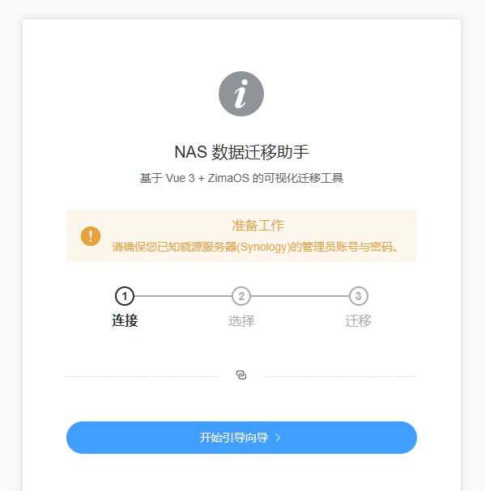
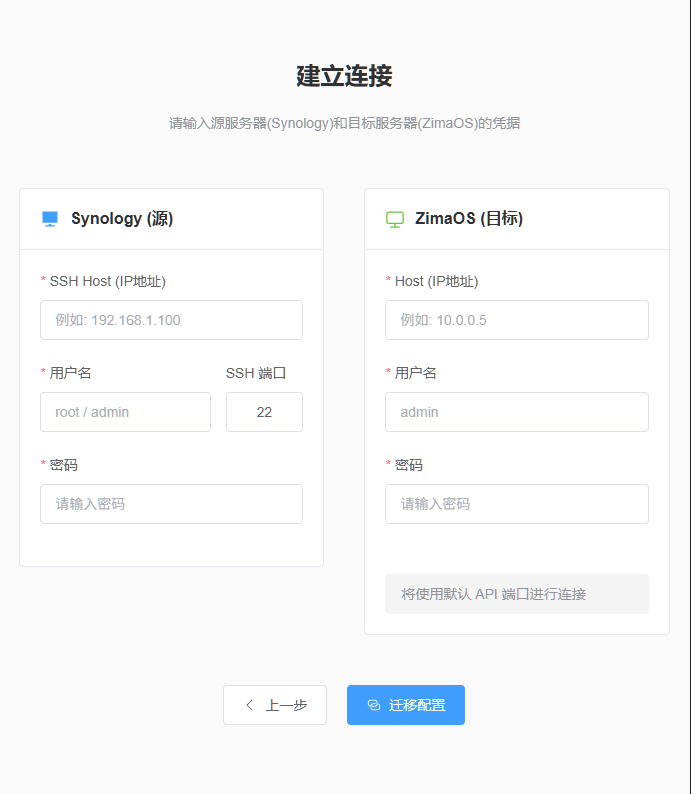
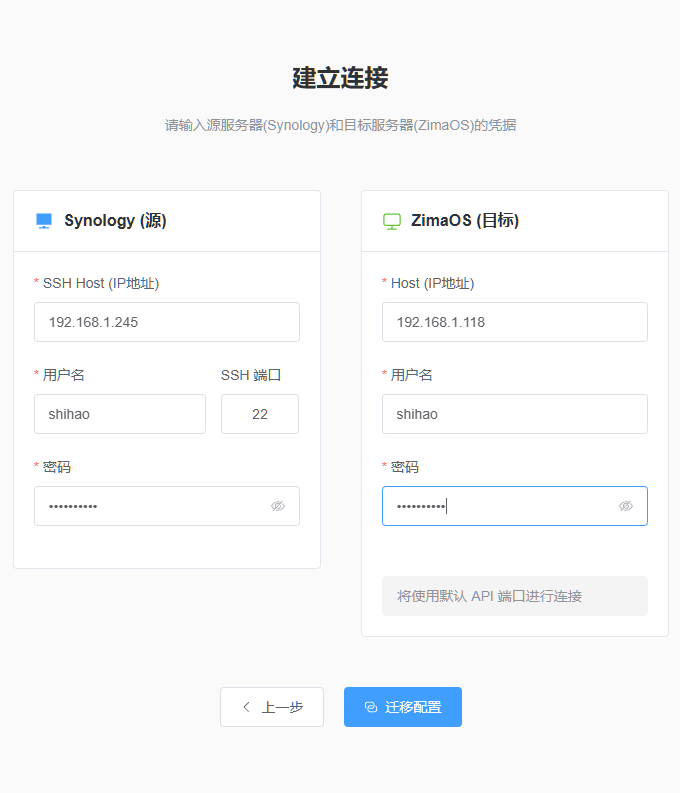
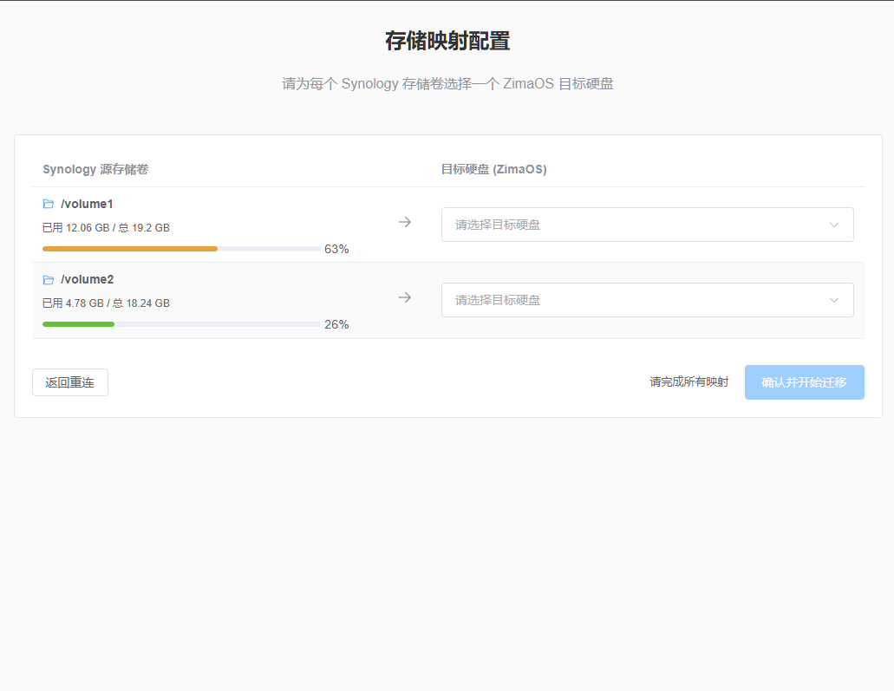
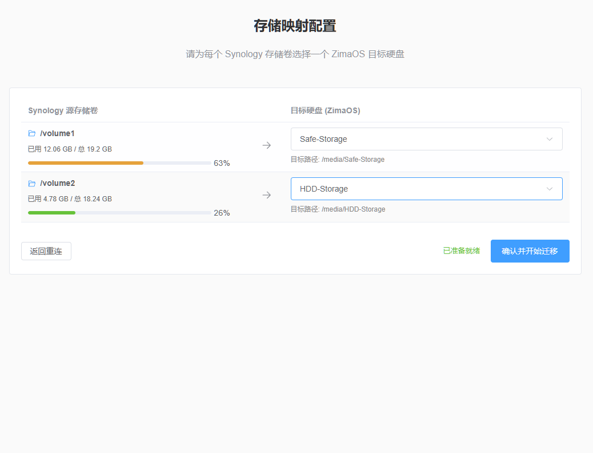
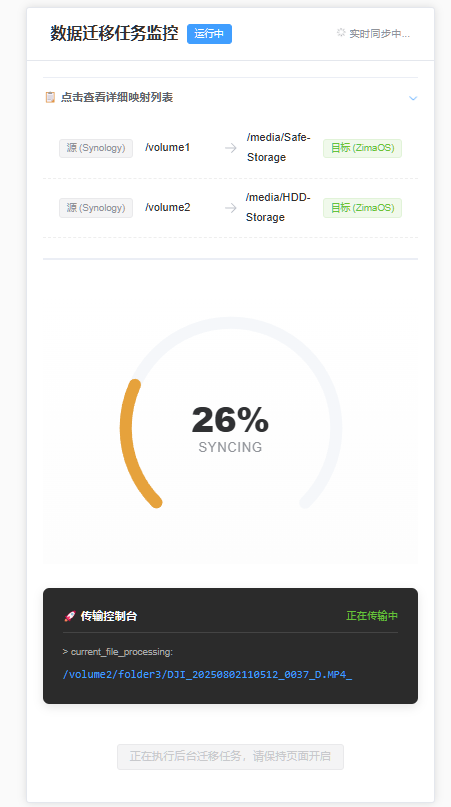
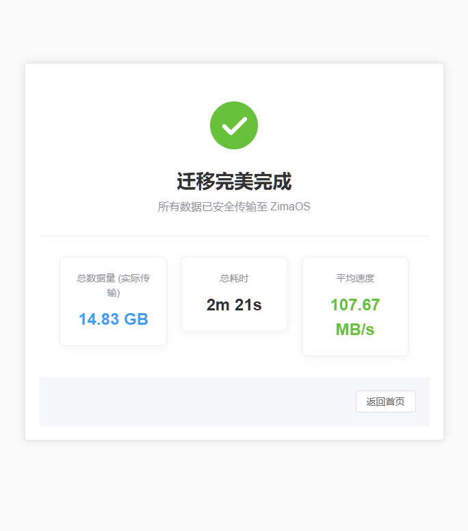

# 功能演示文档

尽量保持ZimaOS的硬盘清洁, 防止冲突导致的迁移失败. 另外请确保群晖管理员(可以非超管)的SSH连接已打开.

1. 访问容器服务端口5174

2. 点击"开始引导向导"开始配置连接

3. 输入Synology的管理员SSH配置信息, 以及ZimaOS的管理员信息

4. 点击"迁移配置", 进入存储映射配置

5. 每个群晖的卷可以迁移到ZimaOS中的一个硬盘(允许一对多, 但要保证文件夹命名不冲突), 请根据每个卷的空间手动选择合适的ZimaOS硬盘

6. 点击"确认并开始迁移"

7. 等待迁移过程请不要刷新页面

8. 迁移完成后可以查看迁移报告

